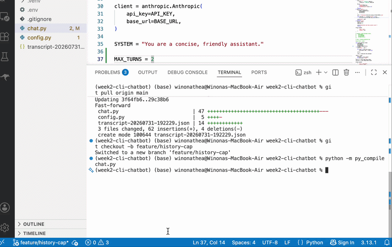

# Week 2 CLI Chatbot

A Python terminal chatbot built with the Anthropic SDK and the GLM-4.7 model through an Anthropic-compatible API.

## Features

- Conversation history
- Streaming responses
- Input and output token tracking
- Estimated token cost
- `/tokens` command
- `/save` command
- `/reset` command
- Configurable conversation history cap

## Setup

Create a virtual environment:

```bash
uv venv
```

Activate the virtual environment:

```bash
source .venv/bin/activate
```

Install the required packages:

```bash
uv pip install anthropic python-dotenv pydantic
```

Create a `.env` file:

```env
ANTHROPIC_API_KEY=your_api_key
ANTHROPIC_BASE_URL=https://api.z.ai/api/anthropic
PRICE_IN_PER_MILLION=0.6
PRICE_OUT_PER_MILLION=2.2
```

Do not commit the `.env` file because it contains the API key.

## Run

```bash
python chat.py
```

## Commands

- `/tokens` displays the total input tokens, output tokens, and estimated cost.
- `/save` saves the complete conversation to a JSON file.
- `/reset` clears the conversation history and token counters.
- `/quit` or `exit` closes the chatbot.

## Token Cost

The estimated cost is calculated using:

```text
(input tokens / 1,000,000 × input price)
+
(output tokens / 1,000,000 × output price)
```

The current configuration uses the GLM-4.7 API prices.

## History Cap

The chatbot stores the complete conversation history for `/save`, but only sends the most recent conversation turns to the model.

This prevents API requests from growing indefinitely while preserving the complete local transcript.


## Demo

